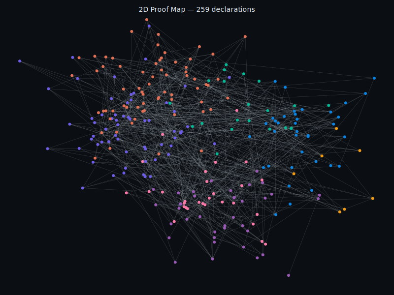
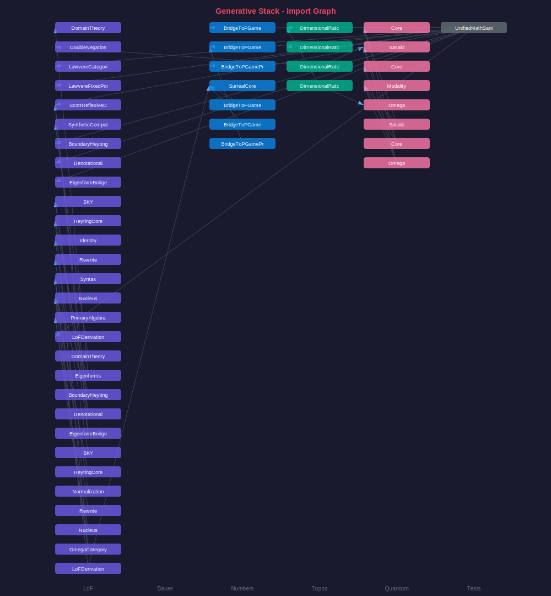

# Generative Stack - Verified Lean 4 Formalization

<p align="center">
  <strong>Machine-checked proof that mathematical structure emerges generatively from the Void</strong><br/>
  <em>
    Lean 4 formalization of the 7-layer hierarchy: Void → LoF → Eigenforms → Heyting → Surreals → Combinators → Types
  </em>
</p>

<p align="center">
  
  
  
</p>

---

Part of the broader HeytingLean formal verification project: https://apoth3osis.io

## Overview

This repository contains a **standalone, verifiable** Lean 4 formalization of the Generative Stack - a 7-layer mathematical hierarchy proving that:

1. **Numbers arise** from pure distinction (Laws of Form)
2. **Fixed points exist** (Lawvere's theorem, type-theoretic and categorical)
3. **Games encode arithmetic** (Surreal number bridge)
4. **Logic structures emerge** (Heyting algebras from nuclei)
5. **Dimensional ratchets** constrain modality (1D→2D→3D)

## Quick Start

```bash
# 1. Ensure you have Lean 4 (elan recommended)
curl https://raw.githubusercontent.com/leanprover/elan/master/elan-init.sh -sSf | sh

# 2. Clone and build
git clone https://github.com/Abraxas1010/generative-stack-lean.git
cd generative-stack-lean
lake update
lake build --wfail

# 3. Verify with our script
./scripts/verify_generative_stack.sh
```

### Interactive Visualizations (GitHub Pages)

- **Landing Page:** https://abraxas1010.github.io/generative-stack-lean/
- **2D Proof Map:** https://abraxas1010.github.io/generative-stack-lean/artifacts/visuals/generative_2d.html
- **3D Proof Map:** https://abraxas1010.github.io/generative-stack-lean/artifacts/visuals/generative_3d.html

## Key Theorems

| Theorem | Location | Significance |
|---------|----------|--------------|
| `LawvereFixedPoint.lawvere_fixed_point` | `LoF/Bauer/LawvereFixedPoint.lean` | Type-theoretic Lawvere |
| `ccc_lawvere_fixed_point` | `LoF/Bauer/LawvereCategorical.lean` | CCC categorical form |
| `toIGame_addConway` | `Numbers/Surreal/BridgeToPGamePreservation.lean` | Addition preservation |
| `toIGame_negConway` | `Numbers/Surreal/BridgeToPGamePreservation.lean` | Negation preservation |
| `denote_steps` | `LoF/Combinators/Denotational.lean` | SKY combinator soundness |
| `reentry_fixed_eq` | `LoF/Nucleus.lean` | Fixed point identity |
| `omega_is_heyting` | `LoF/HeytingCore.lean` | Heyting from nucleus |

## Directory Structure

```
HeytingLean/
├── LoF/                    # Laws of Form layer
│   ├── Nucleus.lean        # Re-entry nuclei
│   ├── HeytingCore.lean    # Heyting algebra emergence
│   ├── BoundaryHeyting.lean
│   ├── Bauer/              # Eigenforms & Lawvere
│   │   ├── LawvereFixedPoint.lean
│   │   ├── LawvereCategorical.lean
│   │   ├── Eigenforms.lean
│   │   └── ...
│   └── Combinators/        # SKY calculus
│       ├── SKY.lean
│       └── Denotational.lean
├── Numbers/                # Surreal numbers
│   ├── SurrealCore.lean
│   └── Surreal/
│       ├── BridgeToPGame.lean
│       ├── BridgeToPGamePreservation.lean
│       └── LoFDerivation.lean
├── Topos/                  # Dimensional ratchet
│   ├── DimensionalRatchet.lean
│   └── DimensionalRatchetTranslate.lean
├── Quantum/                # OML layer
│   ├── OML/Core.lean
│   └── Translate/
└── Tests/
    └── UnifiedMathSanity.lean
```

## Proof Visualizations

Explore the proof structure in 2D and 3D:

<table>
<tr>
<td align="center" width="50%">
<strong>2D Proof Map</strong><br/>
<em>Pan, zoom, search declarations</em><br/>
<a href="https://abraxas1010.github.io/generative-stack-lean/artifacts/visuals/generative_2d.html">
  
</a><br/>
<a href="https://abraxas1010.github.io/generative-stack-lean/artifacts/visuals/generative_2d.html">generative_2d.html</a> (GitHub Pages)
</td>
<td align="center" width="50%">
<strong>3D Proof Map</strong><br/>
<em>Rotate, zoom, explore clusters</em><br/>
<a href="https://abraxas1010.github.io/generative-stack-lean/artifacts/visuals/generative_3d.html">
  
</a><br/>
<a href="https://abraxas1010.github.io/generative-stack-lean/artifacts/visuals/generative_3d.html">generative_3d.html</a> (GitHub Pages)
</td>
</tr>
</table>

### Layer Architecture

<p align="center">
<a href="https://abraxas1010.github.io/generative-stack-lean/artifacts/visuals/generative_stack_overview.svg">
  
</a>
</p>

### Import Graph

<p align="center">
<a href="https://abraxas1010.github.io/generative-stack-lean/artifacts/visuals/import_graph.svg">
  
</a>
</p>

**UMAP note (interpretation + limitations):**
- UMAP is a non-linear projection of high-dimensional feature vectors into 2D/3D; here the features are derived from Lean source text statistics and structural signals.
- Only *local neighborhoods* are intended to be meaningful; global distances/cluster geometry are not proof-theoretic invariants.
- Treat these maps as navigational aids; the formal guarantee is the Lean kernel check.

## Dependencies

- **Lean 4**: `leanprover/lean4:v4.16.0`
- **Mathlib**: `v4.24.0`
- **CombinatorialGames**: For PGame/Surreal bridge

## Verification

Run the full verification:

```bash
./scripts/verify_generative_stack.sh
```

This checks:
1. No `sorry` or `admit` in source
2. Clean `lake build --wfail`
3. Hash verification of key files

## License

**Copyright (c) 2022-2026 Equation Capital LLC. All rights reserved.**

This software is available under a **dual licensing model**:
- **AGPL-3.0** for open source, academic, and personal use
- **Commercial License** available for proprietary use

See [LICENSE.md](LICENSE.md) for details. Contact: rgoodman@apoth3osis.io

## Citation

If you use this formalization in your research, please cite:

```bibtex
@software{generative_stack_lean,
  title = {Generative Stack: A Lean 4 Formalization},
  year = {2025},
  note = {Mechanized proof that mathematical structure emerges from the Void}
}
```

## Contact

For questions or issues, please open a GitHub issue or contact rgoodman@apoth3osis.io

---

<p align="center">
  <em>Part of the <a href="https://apoth3osis.io">HeytingLean</a> formal verification project</em>
</p>
